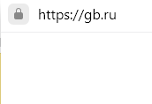
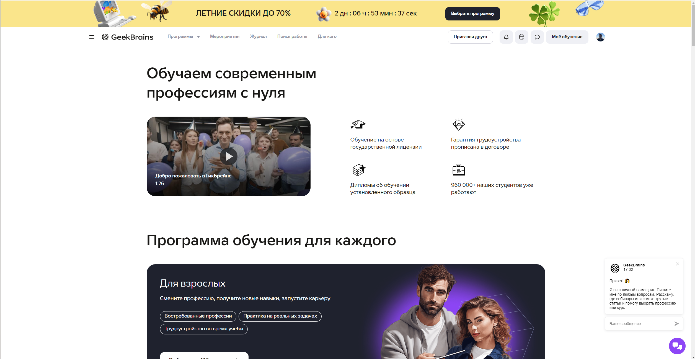
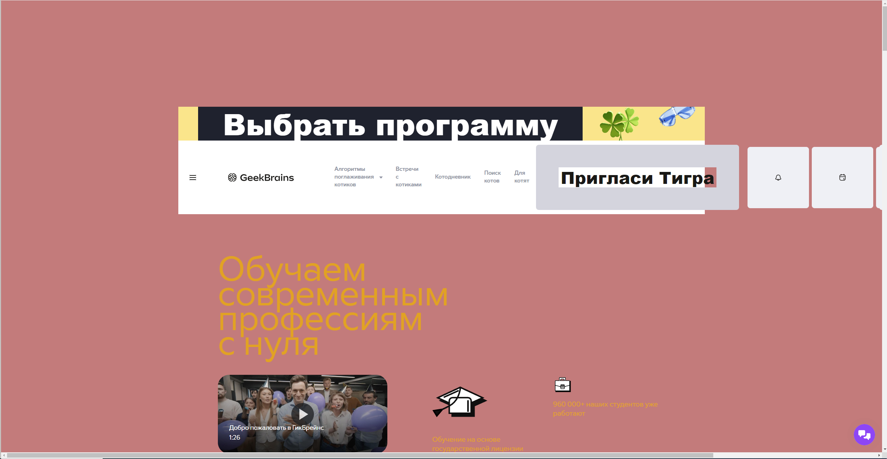

Задача: на основе сайта dzen.ru или gb.ru:
1. Определите, на каком протоколе работает сайт.
2. Внесите не менее 7 изменений на страницу с помощью инструмента разработчика и представьте скриншоты было/стало.
3. Создайте прототип низкой детализации (на основе сайта dzen.ru или gb.ru).

Данная промежуточная аттестация оценивается по системе "зачет" / "не зачет".
"Зачет" ставится, если Слушатель успешно выполнил 3 или 2 критерия.
"Не зачет" ставится, если Слушатель успешно выполнил 1 или меньше критериев.

Критерии оценивания:
1 - Слушатель корректно определил, на каком протоколе работает сайт.
2 - Слушатель внес не менее 7 изменений на страницу с помощью инструмента разработчика и описал внесенные изменения.
3 - Слушатель создал прототип низкой детализации.

---
Решение:
1. gb.ru работает на протоколе https 
   1. 
2. Изменения
   1. **До** 
   2. **После** 
   3. Изменения
      1. Некоторые блоки удалены (много)
      2. Надписи меню изменены
      3. Цвет фона изменен
      4. Изменен размер шрифта
      5. Изменен цвет шрифта
      6. Изменены отступы padding
      7. Изменены отступы margin
3. Прототип низкой детализации gb.ru: https://wireframe.cc/CMHQcw